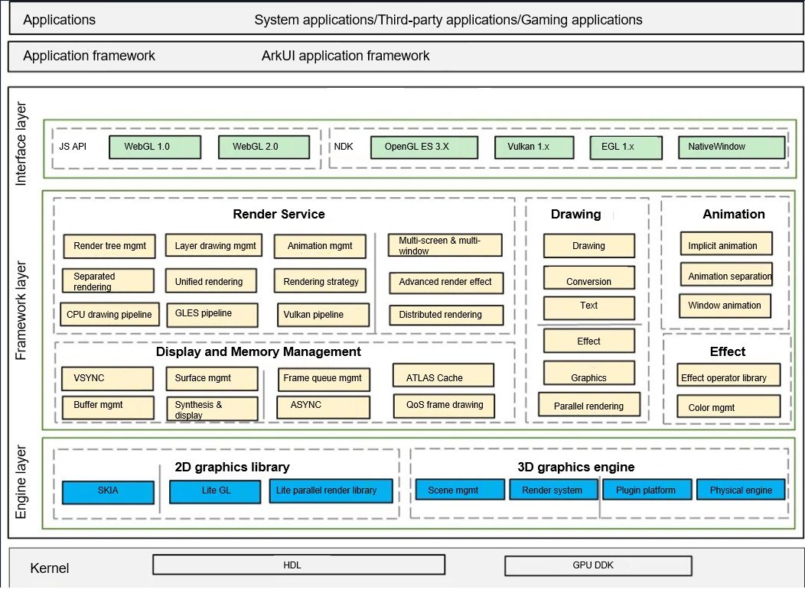

# Graphics Subsystem

The Graphics subsystem mainly consists of user interface (UI) components, layout, animator, font, input event, window management, and rendering and drawing modules. It is an application framework that can be built on the standard OS to develop OpenHarmony applications for standard- and large-system devices.

## Introduction

The Graphics subsystem provides graphics APIs.

The following figure shows the architecture of the Graphics subsystem.



The OpenHarmony graphics stack is divided into the following layers:

Interface layer: provides native APIs for the Graphics subsystem, including WebGL, native drawing, and OpenGL command-level drawing.

Framework layer: consists of the Render Service, Drawing, Animation, Effect, and Display and Memory Management modules.
| Module                    | Description                                                                                      |
|------------------------|--------------------------------------------------------------------------------------------|
| Render Service| Performs UI framework drawing. This module converts the ArkUI component description into drawing tree information and renders the optimal path based on the corresponding rendering policy. It also provides the core underlying mechanism for multi-window smoothness and spatial UI sharing.      |
| Drawing          | Provides standard internal interfaces in the Graphics subsystem to implement 2D rendering, 3D rendering, and rendering engine management.                                               |
| Animation        | Provides capabilities related to the animation engine.                                                                              |
| Effect           | Processes image effects and rendering effects, including cascading and parallel processing of multiple effects, and adding rendering effects and component interaction effects during layout.                              |
| Display and Memory Management               | Decouples the graphics stack from hardware and provides OpenHarmony display and memory management. OEMs need to adapt the HDIs defined by this module.|

Engine layer: consists of the 2D graphics library and 3D graphics engine. The 2D graphics library provides bottom-layer APIs for 2D graphics drawing (including text drawing). The 3D graphics engine capability is being developed.


## Directory Structure

```
foundation/graphic/graphic_cangjie_wrapper
├── ohos             # Cangjie Graphics Subsystem code
├── kit              # Cangjie kit code
├── figures          # architecture pictures
```

## Repositories Involved

**Graphics subsystem**

graphic_cangjie_wrapper
