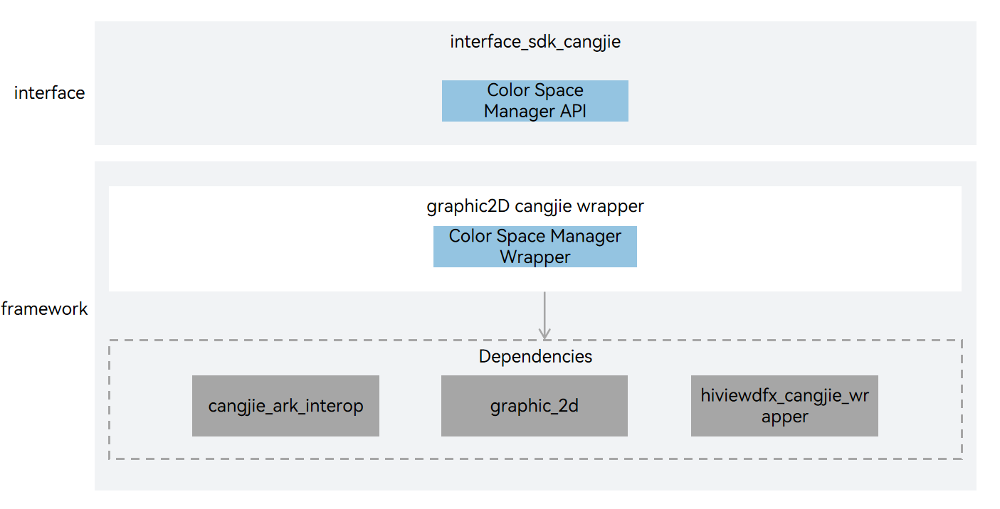

# graphic_cangjie_wrapper

## Introduction

The graphic_cangjie_wrapper is a Cangjie API encapsulated on OpenHarmony for application developers to provide Cangjie color management capability API. The currently open file management Cangjie interface only supports standard devices.

## System Architecture

The following figure shows the architecture of the Graphics subsystem.

**Figure 1** Architecture of the Graphics subsystem


As shown in the architecture diagram:

Interface layer description:

- Color Management API: Cangjie public interfaces based on color management encapsulation exposed to developers.

Framework layer description:

- Color Management Wrapper: Provide gamut-dependent configuration capabilities. This encapsulation layer is a Cangjie encapsulation implementation of color management functionality based on graphic_2d.

Cangjie Graphics Dependencies:

- graphic_2d: Provides native functionality implementation of image effects, rendering effects and other effects processing capabilities that can be called by the graphics Cangjie wrapper, including: multi-effect series and parallel processing, adding rendering effects, control interaction effects and other related capabilities during layout.
- Cangjie Interop: Encapsulates public interfaces for C language interoperation, and provides Cangjie tag class implementation for annotating Cangjie APIs, as well as providing BusinessException exception class definitions thrown to users.
- Cangjie DFX: Responsible for providing log interfaces, providing Cangjie interfaces that can be called by the graphics Cangjie interface to print logs at critical paths.

## Directory Structure

```
foundation/graphic/graphic_cangjie_wrapper
├── figures                           # architecture pictures
├── kit                               # Cangjie Graphics kit code
│   └── ArkGraphics2D                 # Cangjie ArkGraphics2D code implementation
├── ohos                              # Cangjie Graphics Subsystem code
│   └── graphics                      # Cangjie Graphics code implementation
│       └── color_space_manager       # Color management module
└── test                              # Cangjie test code
    └── color_manager                 # Color management tests
```

## Usage Guidelines

The current Cangjie Graphics interface provides only Color Management.

Color management, including creating standard color spaces and custom color spaces, as well as methods for obtaining color space related information. Supports developers in setting/getting color space related information in image processing and camera management.

For usage guidelines, please refer to [Color Management Development Guide](https://gitcode.com/openharmony-sig/arkcompiler_cangjie_ark_interop/blob/master/doc/Dev_Guide/source_en/graphics/cj-color-manager-development-guide.md).

## Constraints

Compared with the API capabilities provided by ArkTS, the following functions are not supported:

- [Image processing capabilities for image effects and rendering effects](https://gitcode.com/openharmony/docs/blob/master/en/application-dev/reference/apis-arkgraphics2d/js-apis-effectKit.md).
- [Variable frame rate feature for self-drawing UI](https://gitcode.com/openharmony/docs/blob/master/en/application-dev/reference/apis-arkgraphics2d/js-apis-graphics-displaySync.md).
- [HDR (High Dynamic Range) capability](https://gitcode.com/openharmony/docs/blob/master/en/application-dev/reference/apis-arkgraphics2d/js-apis-hdrCapability.md)
- [Text layout and font management capabilities](https://gitcode.com/openharmony/docs/blob/master/en/application-dev/reference/apis-arkgraphics2d/js-apis-graphics-text.md).
- [Effect cascading capability](https://gitcode.com/openharmony/docs/blob/master/en/application-dev/reference/apis-arkgraphics2d/js-apis-uiEffect.md)

## Code Contribution

Developers are welcome to contribute code, documentation, etc. For specific contribution processes and methods, please refer to [Code Contribution](https://gitcode.com/openharmony/docs/blob/master/en/contribute/code-contribution.md).

## Repositories Involved

[graphic_graphic_2d](https://gitcode.com/openharmony/graphic_graphic_2d/blob/master/README.md)

[arkcompiler_cangjie_ark_interop](https://gitcode.com/openharmony-sig/arkcompiler_cangjie_ark_interop/blob/master/README.md)

[hiviewdfx_hiviewdfx_cangjie_wrapper](https://gitcode.com/openharmony-sig/hiviewdfx_hiviewdfx_cangjie_wrapper/blob/master/README.md)