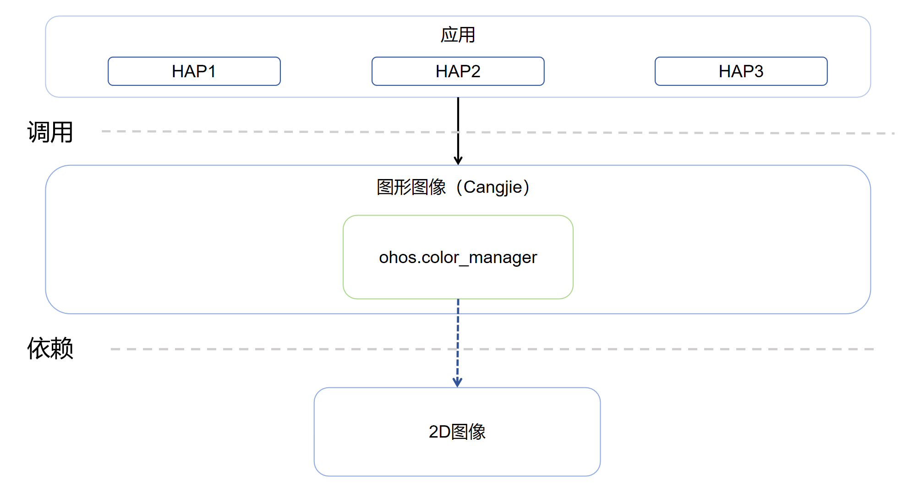

# 图形图像仓颉接口

图形仓颉主要包括UI组件、布局、动画、字体、输入事件、窗口管理、渲染绘制等模块，构建基于标准OS的应用框架满足富设备的OpenHarmony系统应用开发。

## 简介<a name="section1374615251510"></a>

**图形仓颉**  提供了图形接口能力。

其主要的结构如下图所示：



OpenHarmony 图形栈的分层说明如下：

• 接口层：提供图形的 Native API能力，包括：WebGL、Native Drawing的绘制能力、OpenGL 指令级的绘制能力支撑等。

• 框架层：分为 Render Service、Drawing、Animation、Effect、显示与内存管理五个模块。
| 模块                     | 能力描述                                                                                       |
|------------------------|--------------------------------------------------------------------------------------------|
| Render Service （渲染服务） | 提供UI框架的绘制能力，其核心职责是将ArkUI的控件描述转换成绘制树信息，根据对应的渲染策略，进行最佳路径渲染。同时，负责多窗口流畅和空间态下UI共享的核心底层机制。       |
| Drawing （绘制）           | 提供图形仓颉内部的标准化接口，主要完成2D渲染、3D渲染和渲染引擎的管理等基本功能。                                                |
| Animation （动画）         | 提供动画引擎的相关能力。                                                                               |
| Effect （效果）            | 主要完成图片效果、渲染特效等效果处理的能力，包括：多效果的串联、并联处理，在布局时加入渲染特效、控件交互特效等相关能力。                               |
| 显示与内存管理                | 此模块是图形栈与硬件解耦的主要模块，主要定义了OpenHarmony显示与内存管理的能力，其定义的HDI接口需要让不同的OEM厂商完成对OpenHarmony图形栈的适配． |

• 引擎层：包括2D图形库和3D图形引擎两个模块。2D图形库提供2D图形绘制底层API，支持图形绘制与文本绘制底层能力。3D图形引擎能力尚在构建中。


## 目录<a name="section16751364713"></a>

```
foundation/graphic/graphic_cangjie_wrapper
├── ohos             # 仓颉图形仓颉接口实现
├── kit              # 仓颉kit化代码
├── figures          # 存放readme中的架构图
```

## 相关仓<a name="section11578621131119"></a>

- [graphic_graphic_2d](https://gitee.com/openharmony/graphic_graphic_2d/blob/master/README.md)
