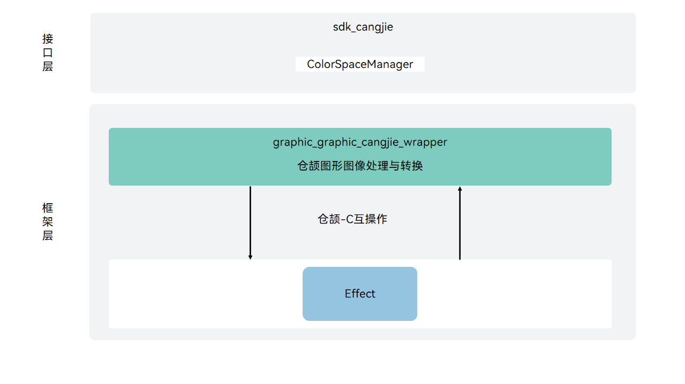

# 图形图像仓颉接口

## 简介

图形图像仓颉接口是在OpenHarmony上基于图形子系统能力之上封装的仓颉API。图形子系统为OpenHarmony提供包括UI组件、布局、动画、字体、输入事件、窗口管理、渲染绘制等模块，构建基于标准OS的应用框架满足standard设备的OpenHarmony系统应用开发。

## 系统架构

其主要的结构如下图所示：

**图 1**  图形图像仓颉架构图


如架构图所示：

- 色彩管理：提供色域相关配置能力。
- 仓颉图形图像FFI接口定义：负责定义C互操作仓颉接口，用于实现仓颉图形图像能力。
- Effect：主要完成图片效果、渲染特效等效果处理的能力，包括：多效果的串联、并联处理，在布局时加入渲染特效、控件交互特效等相关能力。

## 目录

```
foundation/graphic/graphic_cangjie_wrapper
├── figures                # 存放README中的架构图
├── kit                    # 仓颉图形图像kit化代码
│   └── ArkGraphics2D      # 仓颉ArkGraphics2D实现
└── ohos                   # 仓颉图形图像接口实现
    └── graphics           # 仓颉图形接口实现
```

## 使用说明

图形图像仓颉接口当前仅提供了色彩管理相关功能。

与ArkTS相比，暂不支持以下功能：

- UI框架的绘制能力。
- 2D渲染、3D渲染和渲染引擎的管理。
- 动画引擎的相关能力。
- 图片效果、渲染特效能力。
- 显示与内存管理能力。


图形相关API请参见[ohos.graphics.color_space_manager（色彩管理）](https://gitcode.com/openharmony-sig/arkcompiler_cangjie_ark_interop/blob/master/doc/API_Reference/source_zh_cn/apis/ArkGraphics2D/cj-apis-color_manager.md)。

## 参与贡献

欢迎广大开发者贡献代码、文档等，具体的贡献流程和方式请参见[参与贡献](https://gitcode.com/openharmony/docs/blob/master/zh-cn/contribute/%E5%8F%82%E4%B8%8E%E8%B4%A1%E7%8C%AE.md)。

## 相关仓

- [graphic_graphic_2d](https://gitee.com/openharmony/graphic_graphic_2d/blob/master/README_zh.md)
