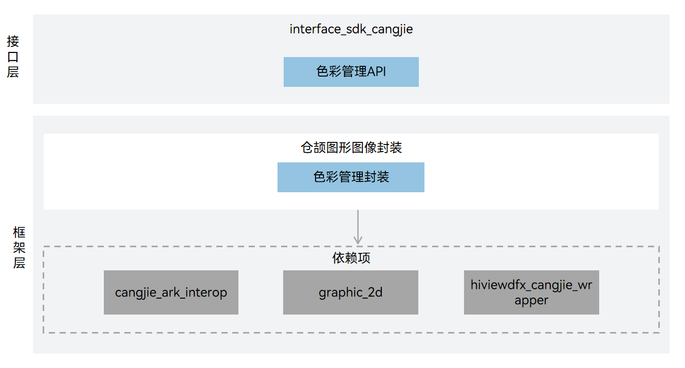

# 图形图像仓颉接口

## 简介

图形仓颉主要包括UI组件、布局、动画、字体、输入事件、窗口管理、渲染绘制等模块，构建基于标准OS的应用框架满足富设备的OpenHarmony系统应用开发。

**图形仓颉**  提供了图形接口能力。

## 系统架构

其主要的结构如下图所示：



## 目录

```
foundation/graphic/graphic_cangjie_wrapper
├── ohos             # 仓颉图形仓颉接口实现
├── kit              # 仓颉kit化代码
├── figures          # 存放readme中的架构图
```

## 约束

当前开放的文件管理仓颉接口仅支持standard设备。

## 使用说明

当前仅提供了色彩管理相关功能。

图形相关API请参见[ohos.graphics.color_space_manager（色彩管理）](https://gitcode.com/openharmony-sig/arkcompiler_cangjie_ark_interop/blob/master/doc/API_Reference/source_zh_cn/apis/ArkGraphics2D/cj-apis-color_manager.md)

## 参与贡献

欢迎广大开发者贡献代码、文档等，具体的贡献流程和方式请参见[参与贡献](https://gitcode.com/openharmony/docs/blob/master/zh-cn/contribute/%E5%8F%82%E4%B8%8E%E8%B4%A1%E7%8C%AE.md)

## 相关仓

- [graphic_graphic_2d](https://gitee.com/openharmony/graphic_graphic_2d/blob/master/README_zh.md)
